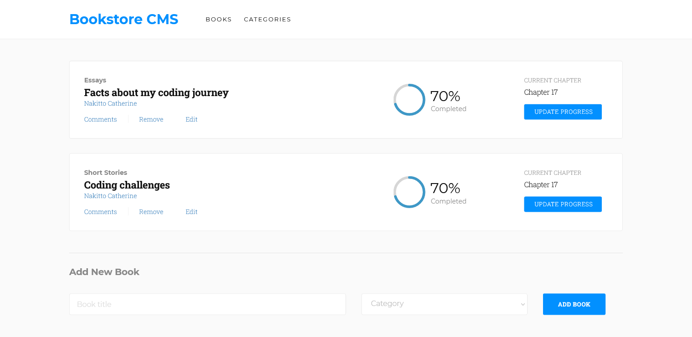

## Book Store

### Milestone 1:
- Initialize React app.
- Add React Redux (npm install react-redux) to it.
- Structure the application files using a "feature folder" approach and used the ducks pattern for the Redux files.
- Add React Router to set s and s for the app's navigation.
- Display the list of books with a remove button.
- Add a form for adding a book.
- Add Categories component displaying "Under construction" text only.

## Built With

- HTML, CSS & JS
- Visual Studio Code
- Webpack
- Linters
- ReactJS

## Deployed Online
- [Project Live link]()

## Set up locally

- Open your terminal and run the following command: git clone https://github.com/Cathella/book-store.git
- Run the command "yarn install"
- Run the command "yarn start"

Once you completed this steps you should see the app running at: http://localhost:3000/ in your browser.

## Author 👤

👤 **Nakitto Catherine**

- GitHub: [@githubhandle](https://github.com/Cathella)
- Twitter: [@twitterhandle](https://twitter.com/cathella9)
- LinkedIn: [LinkedIn](https://www.linkedin.com/in/nakitto-catherine2020/)

## 🤝 Contributing

Contributions, issues, and feature requests are welcome!

Feel free to check the [issues page](https://github.com/Cathella/book-store/issues)

## Show your support

Give a ⭐️ if you like this project!

## Acknowledgments

- Hat tip to anyone whose code was used
- Inspiration
- etc